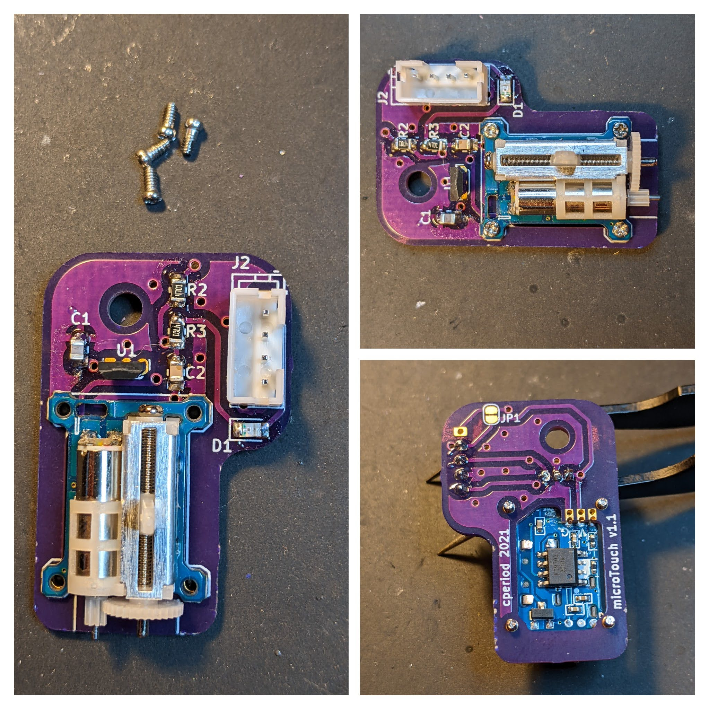

# microTouch

Compact 3D printer bed probe based (very) loosely on the
[TinyTouch NMPG](https://www.thingiverse.com/thing:4661556).

I designed and built the first prototype a couple years ago. The current
version has been running since (approximately) May 2022 and has been
quite reliable, with only one misfire that I can remember.

# Design

It uses the same nano servo and a gravity based deployment as the
TT NMPG just started as a project to build a smaller TT PCB, but I've
changed it up to use a hall effect sensor with a small magnet embedded
in the slider, which allows for an even more compact package. I've also
changed the connector to a PH 2.0 and removed the servo connector
completely, soldering it directly to the PCB.

The size of the PCB is approximately 35mm x 25mm, and the shell will add
another 10mm or so. It should comfortably fit in the space needed by
a BLTouch.

I think there's room to crunch the design down even smaller, but I'm not
sure there's any need for a nanoTouch.

# Bill Of Materials

There's an [Interactive BOM](bom/ibom.html) for the electronics.

 * Nano linear servo (RH only). In theory you could use a LH version, but you'd
need to flip the mirror *everything*, including the hall sensor and magnet.
I haven't tested that.
 * A3144 hall effect sensor. This is an obsolete part, but it's still
available.
 * JST PH 2.0 connector. You can use a four or five pin, depending on
whether you need a different voltage for the signal than what the servo
uses (i.e. servo is 5V, signal might be 3.3V). If you use the 5 pin version
then you'll need to cut the solder jumper on the back.
 * 10uF, 100nF 0805 capacitors
 * 4.7K 0805 resistors
 * 0805 red LED (other colors probably work, but I've only tested red)

You'll need a PCB. It *can* be homemade (I made the first version on a PCB
mill), but you'll have a battle with the servo pads. I ordered my finished
versions [from Oshpark](https://oshpark.com/shared_projects/54oETibN),
and you can't really beat the price for something that small.

You'll need printed parts. Minimally the slider and the cover, and I found
a backer/spacer necessary, but you might need to design a different way to
mount to your printer.  I printed the slider with
[Igus iglide I150-PF](https://www.igus.com/product/12404),
but probably anything would work okay. The slider and the body need to be
sanded to ensure smooth deployment, and getting that right is by far the
most finicky part of the job.

For the probe itself I use a M3 bolt (25mm, I think?), but anything you can
thread into the slider body should be fine as long as it has some weight to
it. The bolt can be threaded in quite far and is the main way to adjust
the position of the problem, along with the servo angles.

# Assembly

Remove the wires from the servo.

Do this by scraping away the glue at the PCB, then desolder the wires and
touch up the pads with fresh solder. Don't overbuild solder on the pads,
they should be somewhat flat.

Solder the components. See the Interactive bom for details of what goes
where. Do the surface mount components first or you'll find things get
cramped. The hall sensor should be mounted a bit off the board, just below
where the slider will clear it.

Attach the servo.

I used tiny eyeglass screws (I want to say 1mm) without bothering to thread
anything. At the back, the wire pads on the servo should align
with the three
[castellated pads](https://docs.oshpark.com/tips+tricks/castellation/).

Solder the servo pads to the castellanations. This is done by stabbing the
iron tip down so it's touching both the pad and the side of the
catellanation, and wicking solder from the top. A fine tip and small
diameter solder would be good for this, and you don't need much solder.

With the PCB done, it's time to assemble everything else. It's not a bad
idea to thread the mounting hole for M3 now, but it's probably not
necessary.  Insert the
slider, screw in the plunger, and the PCB should just press in from the
back.

Then attach it to your printer. Mine is attached through a hole in the back
of my X carriage.

In hindsight, I probably could have put the connector on the other side.

# Configuration

At the configuration level, it's just your average servo-based probe.
Depending on your servo, polishing, and assembly you *might* not be
able to use the full 180 degree range of the servo due to binding,
but you can still easily achieve a 5mm range between stowed and deployed.
